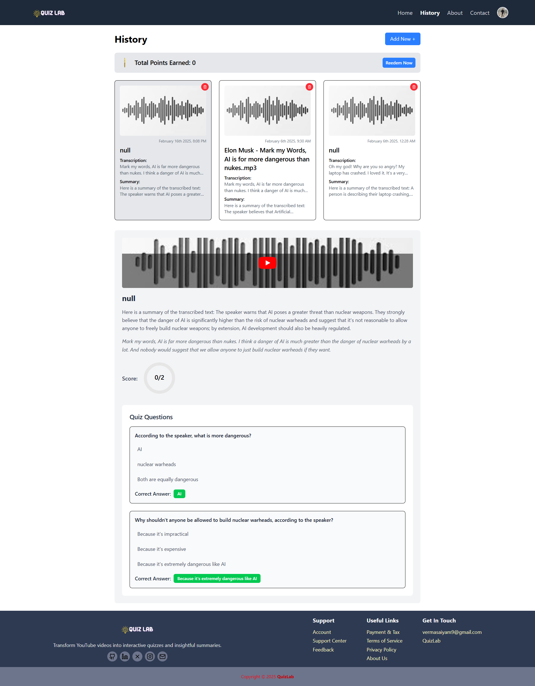

# QuizLab

QuizLab is an AI-powered platform that converts YouTube URLs, audio files, video files, and uploaded documents into transcriptions, summaries, and quizzes. Users can earn coins by answering quiz questions correctly, which can be redeemed for goodies. The platform keeps track of the history of transcribed content and allows users to retake quizzes and view answers. It is built using the **MERN stack** and **Flask**, with **Whisper** for transcription and **Groq AI** for summarization and quiz generation.

---

## Features

1. **Authentication** - Secure login and signup with JWT authentication.
2. **Homepage** - Upload YouTube URLs, audio, video, or files for processing.
3. **Summary Page** - AI-generated summarized content.
4. **Quiz Page** - Auto-generated quizzes based on the summary.
5. **Result Page** - Displays quiz results and earned coins.
6. **History Page** - View past uploads and quizzes.
7. **Profile Page** - Manage user profile and track earnings.

---

## Installation

### Backend Setup (Flask API)

1. **Clone the repository:**
   ```sh
   git clone https://github.com/Vermasaiyam/QuizLab-Webwizard.git
   cd QuizLab
   ```

2. **Install Python dependencies:**
   ```sh
   pip install -r requirements.txt
   ```

3. **Activate virtual environment:**
   - Windows:
     ```sh
     venv\Scripts\activate
     ```
   - macOS/Linux:
     ```sh
     source venv/bin/activate
     ```

4. **Run the backend server:**
   ```sh
   python main.py
   ```

### Frontend Setup (React)

1. **Navigate to the frontend directory:**
   ```sh
   cd Frontend/
   ```
2. **Install dependencies and start the development server:**
   ```sh
   npm install
   npm run dev
   ```

### Start the Node.js Backend

1. **Navigate to the backend directory:**
   ```sh
   cd Backend/
   ```
2. **Install dependencies and run the server:**
   ```sh
   npm install
   npm run dev
   ```

---

## Environment Variables

Create a `.env` file in the root directory and add the following:

```sh
PORT=
URL=
MONGO_URI=
SECRET_KEY=
API_KEY=
API_SECRET_KEY=
CLOUD_NAME=
```

Replace `your_mongodb_uri_here`, `your_secret_key_here`, etc., with your actual credentials.

---

## Pages Details

### 1. Authentication Page
- Allows users to **sign up and log in** securely using JWT authentication.
- Users receive an access token upon successful login.
- Supports password reset functionality.

### 2. Homepage
- Users can **upload** YouTube URLs, audio files, video files, or documents.
- The uploaded content is processed for transcription, summarization, and quiz generation.

### 3. Summary Page
- Displays the **AI-generated summary** of the uploaded content.
- Provides an overview of key points from the transcription.

### 4. Quiz Page
- Generates quizzes based on the summary.
- Users can **attempt quizzes** and earn coins for correct answers.

### 5. Result Page
- Displays the quiz **results and earned coins**.
- Users can review their correct and incorrect answers.

### 6. History Page
- Users can view their **previous uploads and quizzes**.
- Allows users to **retake quizzes** and review answers.

### 7. Profile Page
- Users can manage their **profile information and track earned coins**.
- Displays user statistics and previous interactions.

---

## Screenshots

### 1. Authentication Page


### 2. Homepage (Upload Section)


### 3. Summary Page


### 4. Quiz Page


### 5. Result Page


### 6. History Page


### 7. Profile Page


---

## Connect with Me

- **Portfolio:** [Saiyam Verma's Portfolio](https://your-portfolio-link.com)
- **LinkedIn:** [Saiyam Verma](https://www.linkedin.com/in/saiyamverma)

---